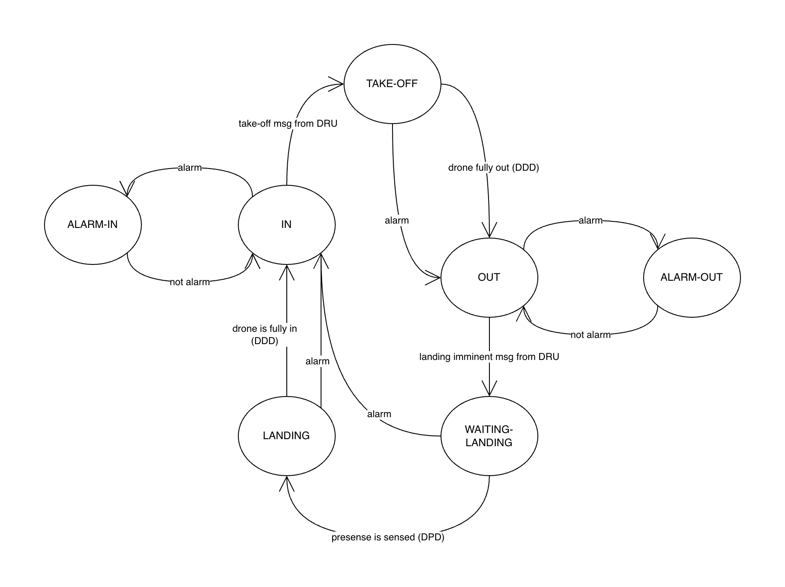
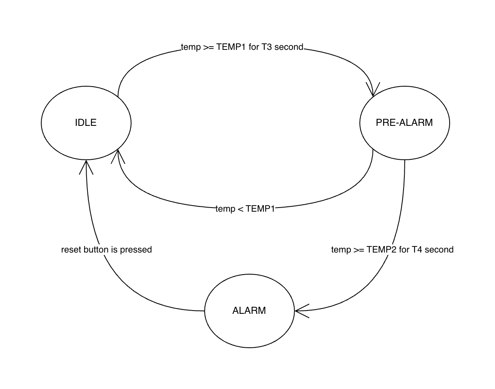
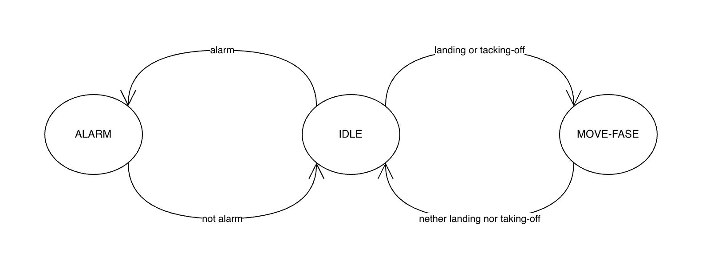

# Second Project - Smart Drone Hangar

The project is about the creation of a system to manage an Hangar of a Drone. It's composed of two parts, the drone-hangar module witch contains the Arduino code (C++) and the drone-remote-unit to be run in the pc connected to the latter. The drone-hangar module is composed of three tasks that are the implementation of the FSMs. The first one is the DroneTask, which is responsible for the control of the drone related aspects (and in such is the most importat). The second one is the AlarmTask, its job is to control the temperature and to set the alarm state. The last one is the LedTask, responsible for reading the overall system state from the context and lighting the LEDs accordingly.

The project consists in the creation of a system to manage a drone hangar. It is composed of two parts:  
1. the **drone–hangar module**, which contains the Arduino code (C++), and  
2. the **drone–remote unit**, which runs on the PC connected to the hangar.

The drone–hangar module is structured into three tasks, each implementing a finite-state machine (FSM).

- **DroneTask** — the most important one. It is responsible for all drone-related control aspects.  
- **AlarmTask** — monitors the temperature and updates the alarm state accordingly.  
- **LedTask** — reads the overall system state from the shared context and activates the LEDs to reflect the correct status.

The drone–remote-unit is written in Python (backend) and JavaScript (frontend). Its job is to manage all messages coming from the Arduino and to send landing and take-off signals.

The Python backend is built using [asyncio_serial](https://pyserial-asyncio.readthedocs.io/en/latest/) and [FastAPI](https://fastapi.tiangolo.com/) to create a fully asynchronous backend that is responsive to messages coming from both the frontend and the Arduino.

The frontend is built using simple HTML, CSS, and JavaScript.

More specific documentation about this component is available in the drone-remote-unit README.

The video is on [OneDrive](https://liveunibo-my.sharepoint.com/:v:/g/personal/alessandro_gardini7_studio_unibo_it/IQBohEbGXImvQKoGYxc3e84ZASYOWnTgeWssjdSMnDjVdyE?nav=eyJyZWZlcnJhbEluZm8iOnsicmVmZXJyYWxBcHAiOiJPbmVEcml2ZUZvckJ1c2luZXNzIiwicmVmZXJyYWxBcHBQbGF0Zm9ybSI6IldlYiIsInJlZmVycmFsTW9kZSI6InZpZXciLCJyZWZlcnJhbFZpZXciOiJNeUZpbGVzTGlua0NvcHkifX0&e=Xa5jXt)

   
  <em>Drone FSM</em>

   
  <em>Alarm FSM</em>

   
  <em>Led FSM</em>

[View the Project 02 Schematic (PDF)](project02_schematic.pdf)
