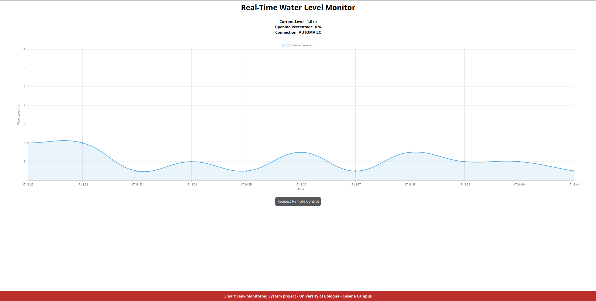

# Real-Time Water Level Monitor
Le specifiche di progetto richiedono l'utilizzo di 4 subsystems da implementare, ciascuno con diverse responsabilità.

- TMS: subsystem repsonsabile di monitorare il livello dell'acqua e cominicarlo al CUS. I valori rilevati da questo subsystem sono poi utilizzati dal CUS per determinare lo stato del sistema e regire di conseguenza.

- CUS: subsystem responsabile del controllo centrale, formato da connessioni, handler e modello.
    - connessioni: Questi moduli si occupano di gestire le connessioni, quindi l'invio e l'arrivo dei messaggi.
    - handler: Si occupa di costruire e fare parsing dei messaggi seguendo una logica predefinita, per poi inviarli tramite le connessioni.
    - modello: 
    Questo è il modulo più importante: contiene una rappresentazione completa dello stato del sistema.
    Il modello incapsula l’oggetto Stato, che mantiene lo stato attuale del sistema ed è responsabile della gestione delle transizioni. Inoltre, il modulo ha il compito di aggiornare gli altri sottosistemi e di ricevere le richieste di cambio di modalità. Tutte le richieste di cambiamento passano attraverso il modello, che ne verifica la correttezza. 

- DBS: subsystem che funge da interfaccia grafica per il sistema. Qui vengono visualizzate informazioni inerenti a tutto il sistema, come livello di acqua e percentuale di apertura. Inoltre l'interfaccia funge anche da pannello per la modalità di controllo remota, permettendo l'apertura e la chiusura della valvola.

- WCS: subsystem responsabile dell'apertura della valvola, azione che viene effettuata una volta ricevuta la comunicazione dal CUS. Oltre a questo il subsystem può attivare la modalita manuale locale per poter controllare manualmente l'apertura della valvola attraverso l'uso di un potenziometro.
